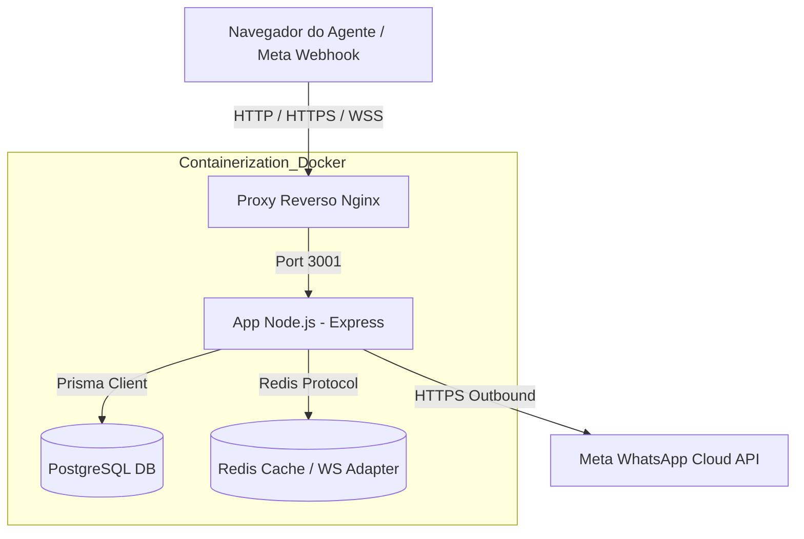

# 🏗️ Guia 1: Arquitetura, Organização de Diretórios e Desenvolvimento do Broker

Este guia fornece uma visão detalhada sobre a arquitetura do **Broker WhatsApp SaaS**, a estrutura de pastas do projeto, a lógica de funcionamento interno e os mecanismos de isolamento multi-tenant.

---

## 🎯 1. Visão Geral da Arquitetura

O Broker é construído sob uma arquitetura de **microserviços conteinerizados** e adota o padrão em camadas **Routes-Middleware-Controller-Service-Data (Prisma ORM)**.



### 1.1 Princípios de Design
- **Leveza (Otimização de Custos)**: O servidor foi desenhado para rodar liso em instâncias VPS de baixo custo (2GB RAM, 1 ou 2 vCPUs).
- **Sem Dependência de Build no Frontend**: O frontend utiliza HTML5, CSS3 e JavaScript Vanilla puros, sem frameworks como React/Vite. Isso reduz a latência de carregamento e simplifica a implantação.
- **Escalabilidade Horizontal**: O backend utiliza Socket.io com Redis Adapter. Caso a carga aumente, é possível subir mais réplicas da imagem `broker_app` atrás do Nginx (load balancer), pois as conexões WebSocket e os estados de URA são sincronizados via Redis.

---

## 📂 2. Estrutura de Pastas e Mapeamento de Arquivos

```
whatsapp-broker/
├── prisma/
│   ├── schema.prisma           # Modelagem de dados e definições de relacionamento
│   └── migrations/             # Migrações aplicadas no banco de dados
├── frontend/                   # Interface estática do usuário (Client-side)
│   ├── css/                    # Estilos visuais (Amberfy theme)
│   ├── js/                     # Comportamentos dinâmicos e conexão de sockets
│   │   ├── admin.js            # Lógica das telas de administração do tenant
│   │   ├── frontend.js         # Interface do painel de atendimento do agente
│   │   ├── security.js         # Proteções de sessão e expiração no client
│   │   └── supervisor.js       # Telas de monitoramento e auditoria em tempo real
│   ├── *.html                  # Interfaces web (login, admin, agent, supervisor, super)
├── src/                        # Código fonte do backend (Server-side)
│   ├── config/                 # Constantes e documentações
│   ├── controllers/            # Handlers de requisições HTTP (Controllers REST)
│   ├── db/                     # Conexão e inicialização do Prisma
│   ├── middleware/             # Interceptadores (Auth, HMAC, Rate Limits, Validações)
│   ├── routes/                 # Definição e agrupamento de rotas REST por módulo
│   ├── schemas/                # Schemas de validação Zod
│   ├── services/               # Serviços com lógica de negócio e integrações
│   └── utils/                  # Loggers e funções auxiliares
├── server.js                   # Arquivo principal e ponto de entrada da aplicação
└── docker-compose.yml          # Orquestração dos containers locais
```

---

## 🔒 3. Mecanismo de Isolamento Multi-Tenant

Para garantir segurança rígida e isolamento de dados no modelo SaaS, implementamos um isolamento em três camadas:

1. **Camada de Banco de Dados**:
   - Todas as tabelas críticas possuem o campo `tenantId` (UUID).
   - O [schema.prisma](file:///c:/Users/Striker/Documents/Broker/Broker/prisma/schema.prisma) vincula essas tabelas ao `Tenant` com exclusão em cascata (`onDelete: Cascade`), garantindo que a remoção de um inquilino exclua automaticamente todos os seus usuários, contatos, conversas e mídias.

2. **Camada de Aplicação (Prisma Queries)**:
   - Em vez de realizar queries globais, todos os controladores injetam de forma imperativa o filtro de tenant nas buscas:
     ```javascript
     const contatos = await prisma.contact.findMany({
       where: { tenantId: req.user.tenantId }
     });
     ```
   - O `req.user.tenantId` é extraído e decodificado de forma segura do token JWT do usuário no middleware de autenticação.

3. **Camada de Comunicação em Tempo Real**:
   - O [socket.js](file:///c:/Users/Striker/Documents/Broker/Broker/src/services/socket.js) gerencia salas de comunicação isoladas.
   - Quando um agente se conecta, o socket o insere na sala de seu tenant:
     ```javascript
     socket.join(`tenant:${tenantId}`);
     ```
   - Eventos de novas mensagens, trocas de status ou conversas na fila são transmitidos exclusivamente dentro da sala do inquilino correspondente, eliminando o vazamento de informações.

---

## 🔀 4. Roteamento Inteligente e Fila de Atendimento

O roteamento de conversas inbound no Broker segue um algoritmo estruturado:

1. **Filtro de Skill (Habilidade)**: O bot pode direcionar a conversa para uma skill específica (ex: "Suporte", "Vendas").
2. **Status do Agente**: Apenas agentes em status `ONLINE` recebem conversas automáticas da fila. Agentes em status `BUSY` ou `AWAY` só podem receber chats por transferência manual direta de outros agentes ou supervisores.
3. **Distribuição por Menor Carga (Least Load)**: Entre os agentes online e aptos (com a skill requerida), o sistema ordena os agentes com base no número de chats ativos (`assignedConversations`). O agente com a menor carga recebe o atendimento.
4. **Capacidade Máxima (Concurrency Limits)**: O sistema valida as propriedades de limite individual do agente:
   - `maxChats`: Limite de chats ativos gerais.
   - `maxReceivedChats`: Limite de chats ativos recebidos (inbound).
   - Se o agente atingir o limite, ele é ignorado e a conversa permanece com o status `QUEUED` na fila de espera geral.

---

## 🔄 5. Real-Time com Socket.io e Adaptação para Cluster

- **Eventos Principais**:
  - `agent_status_changed`: Emitido na sala do tenant quando um agente altera seu status de disponibilidade.
  - `chat_assigned`: Transmite a vinculação de um atendimento a um atendente específico.
  - `conversation_queued`: Notifica que um novo cliente entrou na fila de atendimento humano.
  - `message`: Envia a mensagem recebida/enviada em tempo real para os atendentes conectados no chat correspondente.
- **Redis Adapter**: Configurado no [socket.js](file:///c:/Users/Striker/Documents/Broker/Broker/src/services/socket.js) via `@socket.io/redis-adapter`. Isso permite rodar múltiplos servidores Express em portas ou instâncias diferentes de forma síncrona. Quando um servidor Express emite um socket, o Redis repassa a mensagem para todos os outros servidores que possuem conexões de clientes daquele tenant.
